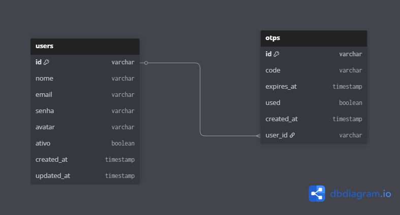
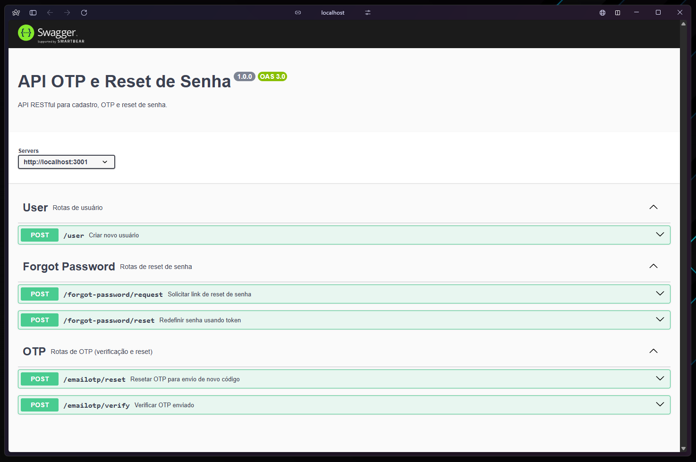

API OTP e Reset de Senha

🗂 Diagrama do Banco de Dados

💻 Testando e-mails localmente

Para validar e-mails sem precisar de servidor real, use Mailpit:

docker run -d -p 1025:1025 -p 8025:8025 axllent/mailpit

- SMTP: localhost:1025
- Painel Web: http://localhost:8025

Mailpit captura e-mails enviados pela API para testes, ideal para verificar OTPs e links de reset de senha.

Documentação interativa do Swagger localmente em:

